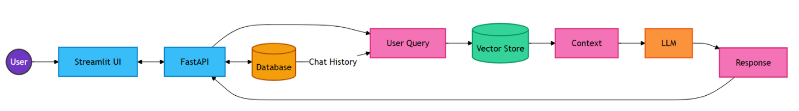
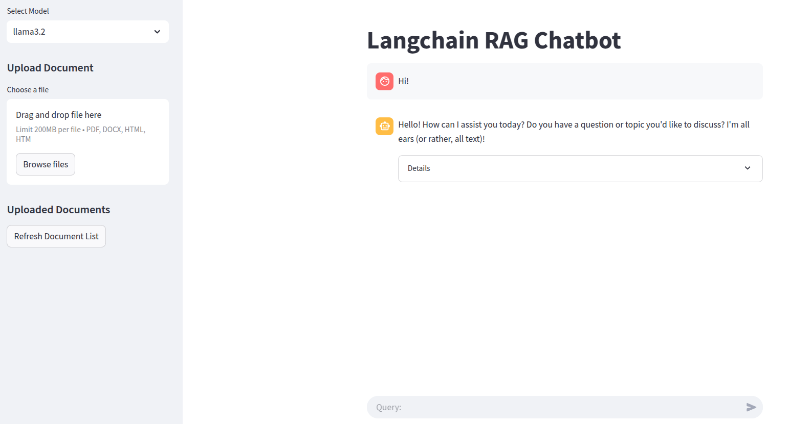

# RAG Project Example

Этот репозиторий содержит пример построения простого Retrieval-Augmented Generation (RAG) приложения с использованием FastAPI, LangChain. Проект разработан в рамках университетской лекции в [БГУИР](https://www.bsuir.by/) и демонстрирует поэтапное создание RAG-системы.

За основу проекта был взят пример, описанный в [статье](https://blog.futuresmart.ai/building-a-production-ready-rag-chatbot-with-fastapi-and-langchain) и доработан для работы с Llama3.2 и демонстрации пошагового построения приложения. 

Выражаю большую благодарность автору статьи!


## 📌 О проекте

- **Технологии**: FastAPI, LangChain, Llama3.2, OpenAI API, ChromaDB, SQLite, Streamlit
- **Архитектура**: 
- **Ключевые возможности**:
  - 💬 Интерактивный чат-интерфейс
  - 📚 Загрузка и обработка документов
  - 🔍 Контекстно-зависимые ответы с использованием RAG
  - 🗄️ Использование баз данных SQLite  и Chroma для постоянного хранения данных
  - 📝 Отслеживание истории чата
  - 🔒 Управление сессиями



## 🚀 Как использовать

### 1. Клонирование репозитория

```bash
git clone https://github.com/KovalM/rag-fastapi-project.git
cd rag-fastapi-project
```

### 2. Создание виртуального окружения и установка зависимостей

```bash
python -m venv venv
source venv/bin/activate  # Для Linux/Mac
venv\Scripts\activate    # Для Windows
# Установка зависимостей может занять около 8 GB дискового пространства
pip install -r requirements.txt
```

### 3. Установка и запуск Llama3.2 через Ollama

```bash
curl -fsSL https://ollama.com/install.sh | sh  # Установка Ollama (Linux/Mac)
powershell -Command "irm https://ollama.com/install.ps1 | iex"  # Установка Ollama (Windows)
ollama pull llama3.2  # Загрузка модели
```

Подробнее об установке Ollama можно прочитать здесь: [Ollama Download](https://ollama.com/download)

### 4. Запуск сервера FastAPI

```bash
cd api
uvicorn main:app --reload
```

API будет доступен по адресу `http://127.0.0.1:8000`. 

Документация API: `http://127.0.0.1:8000/docs`.

### 5. Запуск Streamlit-приложения

```bash
cd app
streamlit run streamlit_app.py
```

Streamlit-интерфейс будет доступен в браузере по адресу `http://localhost:8501`

## 🔍 Пошаговое изучение

Вы можете изучать процесс разработки RAG-приложения, просматривая [историю коммитов](https://github.com/KovalM/rag-fastapi-project/compare/6d7ca7e975a8527874acea1ee9cb6bb9cc07cc75...ef257e34a8ab48ab89edd466bb60b7a9e95b4bb7). Каждый коммит содержит логически завершенный этап работы.

## 📄 Презентация

Подробное объяснение проекта доступно в [презентации](https://docs.google.com/presentation/d/1U23dg7WyAt6UQCZWpEbRMGbDmqfyWyx37K4Xmd6SzCc/edit#slide=id.SLIDES_API1100702386_709).

## 🤝 Контакты

Если у вас есть вопросы или предложения, пишите в Issues или создавайте Pull Request!

- Telegram: [@KovalM_tg](https://t.me/KovalM_tg)

- Email: [michail.kovalev7@gmail.com](mailto:michail.kovalev7@gmail.com)

